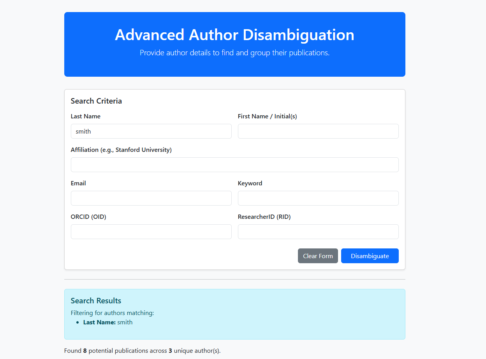
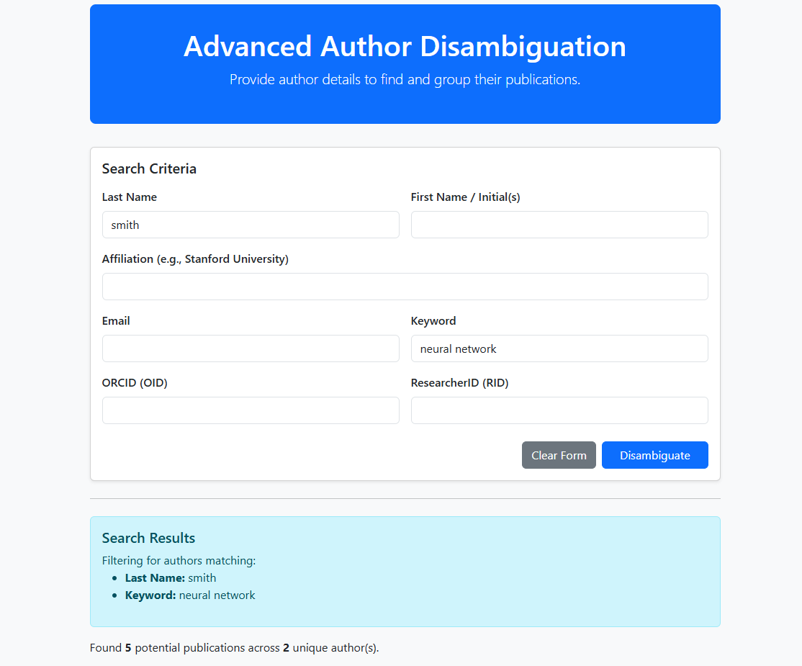
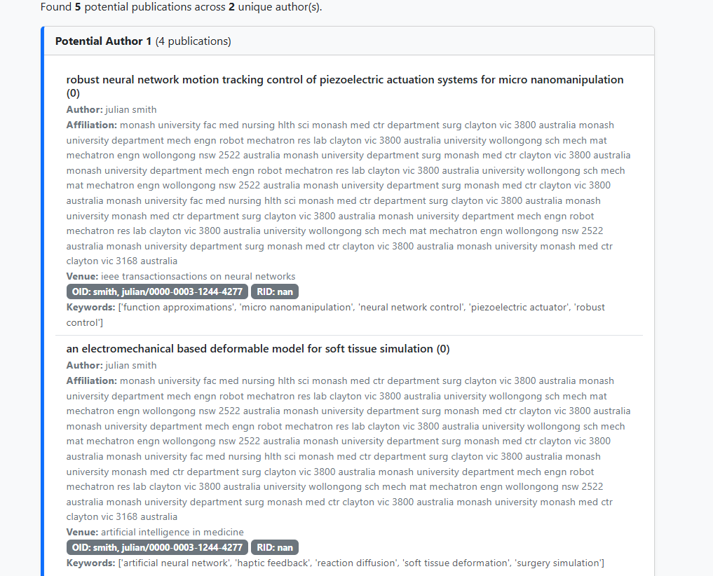
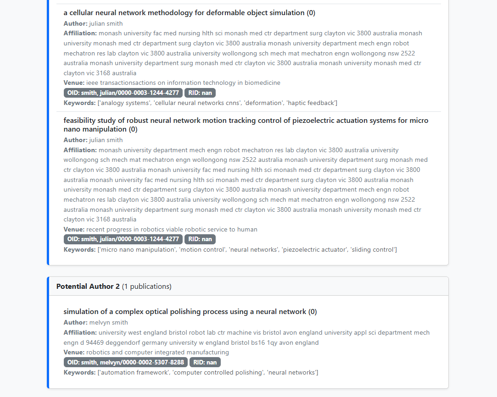

# 👥 Author Name Disambiguation (AND) Framework

## 🌟 Overview

The **Author Name Disambiguation (AND)** project is designed to accurately identify unique authors across a collection of publications, resolving ambiguity caused by shared names (homonyms) and name variations (synonyms). This is critical for maintaining accurate citation metrics and research profiles in academic databases.

The system uses a machine learning approach, specifically a **LightGBM classifier** combined with graph-based clustering, to group publications based on a rich set of similarity features derived from publication metadata.

---

## 🔬 Methodology and Model Pipeline

The core of this project is a **binary classification model** that predicts the likelihood of any two publications belonging to the **same unique author**. This prediction is then used to cluster the publications.

### 1. Feature Engineering

For every pair of publications, a feature vector is calculated, focusing on comprehensive similarity metrics:

*   **Name Similarity**: **Jaro-Winkler** distance on normalized author names.
*   **Topical Similarity**: **Cosine Similarity** between **Sentence-BERT (SBERT)** embeddings of publication titles.
*   **Contextual Similarity**:
    *   **Jaccard Index** on affiliation word sets.
    *   **Jaccard Index** on co-author lists.
    *   **Normalized Levenshtein Distance** similarity on publication venue names.
*   **Temporal Proximity**: An exponential decay function based on the difference in publication years.

### 2. Clustering (Graph-based Disambiguation)

1.  **Prediction**: The trained LightGBM model predicts the probability that a pair of publications are by the same author.
2.  **Graph Construction**: Publications are treated as **nodes** in a graph. An **edge** is created between two nodes if the model's prediction probability exceeds a defined threshold (e.g., 0.5).
3.  **Clustering**: The final author profiles are determined by finding all **connected components** in the graph. Each connected component represents a single, unique author cluster.

---

## 🚀 Application and Usage

The project is deployed via a **Flask** web application that allows users to search for authors and visualize the disambiguation results in real-time.

### Search and Filtering

The interface supports detailed filtering by criteria that are central to the disambiguation process, such as Last Name, First Name, Affiliation, Keyword, ORCID, and ResearcherID, enabling the system to target specific publication subsets.

The system provides immediate feedback on the filtering, indicating the number of potential publications and the unique authors found based on the applied criteria.

| Search Criteria                                             | Result                                                              |
| :---------------------------------------------------------- | :------------------------------------------------------------------ |
| **Last Name**: `smith`                                      | Found **8** potential publications across **3** unique author(s).     |
| **Last Name**: `smith`, **Keyword**: `neural network`       | Found **5** potential publications across **2** unique author(s).     |

### Disambiguation Results

The final output groups publications into distinct author profiles, demonstrating how the model successfully separates homonyms based on the rich feature set.

**Example Output:**

| Potential Author 1 (4 publications)                               | Potential Author 2 (1 publication)                                  |
| :---------------------------------------------------------------- | :------------------------------------------------------------------ |
| **Author**: *Julian Smith*                                        | **Author**: *Melvyn Smith*                                          |
| **Affiliation**: Monash University (consistent)                   | **Affiliation**: University West Bristol, Deggendorf University     |
| **Topics**: micro nanomanipulation, neural network control        | **Topics**: complex optical polishing, computer integrated manufacturing |
| **OID**: `smith/julian/0000-0003-1244-4277` (consistent)            | **OID**: `smith/melvyn/0000-0002-5307-8288`                          |

Below are the detailed views of the clustered results from the application:

---

## ⚙️ Dependencies

This project relies on the following key Python libraries:

*   **`Flask`**: Web framework.
*   **`pandas`**, **`numpy`**: Data manipulation.
*   **`joblib`**: Model persistence (`and_model.pkl`).
*   **`sentence-transformers`**: Generating SBERT embeddings.
*   **`networkx`**: Graph-based clustering.
*   **`lightgbm`**: Core classification model.
*   **`scikit-learn`** and **`python-Levenshtein`**: Feature calculation and machine learning utilities.

